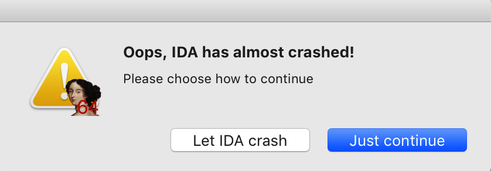

1. #### Fixed when multiply input method the IDA pro7.0 on mojave, ida will crash in non-english input method.

2. #### Fixed shortcuts do not work in non-english input method. Eg: F2, tab, ctrl+enter etc.

```
Replace the "libqcocoa.dylib" to 
/Applications/IDA Pro 7.0/ida.app/Contents/PlugIns/platforms/libqcocoa.dylib
```


#### Binary file checksum:

```
md5 libqcocoa.dylib
MD5 (libqcocoa.dylib) = ff8a1f3fea897c40055cefd7bb7ccf40

shasum libqcocoa.dylib
e1644a89b27aaf570cdb716f72d5e50612373cbf  libqcocoa.dylib
```


#### Detail:

#### When multiply input method the IDA pro7.0 on mojave, ida will crash in non-english input method.


------

##### Solution: 
##### ida7.0 using Qt5.6

##### **crash stack:**

```
Exception Type:        EXC_BAD_ACCESS (SIGSEGV)
Exception Codes:       KERN_INVALID_ADDRESS at 0x00003eadde8f1958
Exception Note:        EXC_CORPSE_NOTIFY

Termination Signal:    Segmentation fault: 11
Termination Reason:    Namespace SIGNAL, Code 0xb
Terminating Process:   exc handler [13886]  

Application Specific Information:
objc_msgSend() selector name: length

Thread 0 Crashed:: Dispatch queue: com.apple.main-thread
0   libobjc.A.dylib               	0x00007fff686faa1d objc_msgSend + 29
1   org.qt-project.QtCore         	0x0000000101903924 QT::QCFString::toQString(__CFString const*) + 52
2   libqcocoa.dylib               	0x0000000103508f67 0x1034c0000 + 298855
```

Cause:
``` c++
    TISInputSourceRef source = TISCopyCurrentKeyboardInputSource();
    CFArrayRef languages = (CFArrayRef) TISGetInputSourceProperty(source, kTISPropertyInputSourceLanguages);
    if (CFArrayGetCount(languages) > 0) {
        CFStringRef langRef = (CFStringRef)CFArrayGetValueAtIndex(languages, 0);
        QString name = QCFString::toQString(langRef);
        QLocale locale(name);
        if (m_locale != locale) {
            m_locale = locale;
            emitLocaleChanged();
        }
        CFRelease(langRef);
    }
```

**langRef** dangling pointer

#### Fixed:
``` c++
#import <Foundation/Foundation.h>

void QCocoaInputContext::updateLocale()
{
    /* https://bugreports.qt.io/browse/QTBUG-48772

    TISInputSourceRef source = TISCopyCurrentKeyboardInputSource();
    CFArrayRef languages = (CFArrayRef) TISGetInputSourceProperty(source, kTISPropertyInputSourceLanguages);
    if (CFArrayGetCount(languages) > 0) {
        CFStringRef langRef = (CFStringRef)CFArrayGetValueAtIndex(languages, 0);
        QString name = QCFString::toQString(langRef);
        QLocale locale(name);
        if (m_locale != locale) {
            m_locale = locale;
            emitLocaleChanged();
        }
        CFRelease(langRef);
    }
    
    */

    QString name = QString::fromNSString([[NSLocale currentLocale] objectForKey:NSLocaleIdentifier]);
    QLocale locale(name);
    if (m_locale != locale) {
        m_locale = locale;
        emitLocaleChanged();
    }
} 
```

#### Recompile Qt5.6
**Download** 
```
https://download.developer.apple.com/Developer_Tools/Xcode_7.3.1/Xcode_7.3.1.dmg
```

**Switch**
```
sudo xcode-select -switch /Applications/Xcode7.app/Contents/Developer
```

**Compile argument**

```
sh configure "-nomake" "tests" "-qtnamespace" "QT" "-confirm-license" "-accessibility" "-opensource" "-force-debug-info" "-platform" "macx-g++" "-debug-and-release" "-fontconfig" "-qt-freetype" "-qt-libpng" "-qt-sql-sqlite" "-prefix" "Qt/5.6.0-x64"
```
FAQ

Xcode not set up properly. You may need to confirm the license agreement by running /usr/bin/xcodebuild.


```
Replace "/usr/bin/xcrun -find xcrun" 
to "/usr/bin/xcrun -find xcodebuild"  
```

